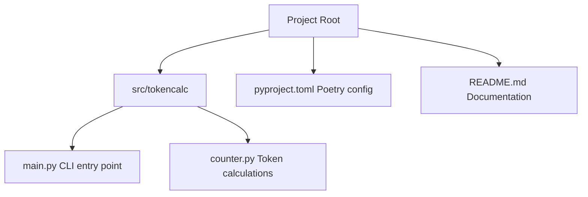

# TokenCalc

Anthropic (Claude) および OpenAI (GPT) のモデルで使用される「トークン数」を、ローカルディレクトリ内のファイルを対象に一括計測・集計するための Python スクリプトです。

## 特徴

- **マルチモデル対応**: OpenAI の `tiktoken` と Anthropic の最新 SDK を使用して計算します。
- **ディレクトリ走査**: 指定されたディレクトリを再帰的に走査し、テキストファイル（`.py`, `.r`, `.sql`, `.md` 等）のトークン数を個別に、および合計で出力します。
- **Poetry 管理**: モダンな Python パッケージマネージャである Poetry を使用して環境を管理します。
- **スマート・フォールバック**: Anthropic の `count_tokens` API には API キーが必要なため、キーが設定されていない環境では `tiktoken` (cl100k_base) による近似値を表示します。

## セットアップ

### 前提条件
- Python 3.10 以上
- [Poetry](https://python-poetry.org/docs/#installation) がインストールされていること

### インストール
リポジトリをクローンした後、プロジェクトディレクトリで以下を実行します：

```bash
# 依存関係のインストールと仮想環境の構築
poetry install
```

## 使用方法

### トークン計算の実行
仮想環境内で `TokenCalc` コマンドを実行します。引数に対象ディレクトリを指定してください。

```bash
# カレントディレクトリを対象にする場合
poetry run TokenCalc .
```

### 出力例
```text
Scanning directory: . (Model: gpt-4o)
------------------------------------------------------------
src/tokencalc/counter.py: Anthropic=499, OpenAI=499
src/tokencalc/main.py: Anthropic=664, OpenAI=664
...
------------------------------------------------------------
Processed 10 files.
Total Anthropic Tokens: 1787
Total OpenAI Tokens: 1787
```

### オプション
- `--model`: `tiktoken` で使用する OpenAI モデルを指定します（デフォルト: `gpt-4o`）。
  ```bash
  poetry run TokenCalc . --model gpt-3.5-turbo
  ```

## プロジェクト構造



## 注意事項
- **Anthropic API キー**: `ANTHROPIC_API_KEY` 環境変数が設定されている場合、公式 API を通じた高精度な計測を試みます。設定されていない場合は、Claude 3 系のトークナイザーに性質が近い `tiktoken` (cl100k_base) を用いた推定値を出力します。
- **除外設定**: `.git`, `node_modules`, `__pycache__` 等の標準的なディレクトリは自動的に集計対象から除外されます。

## ライセンス
MIT License
