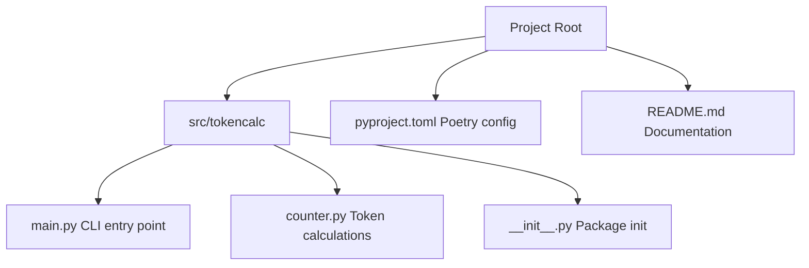

# TokenCalc

Anthropic (Claude)、OpenAI (GPT)、および **Google (Gemini)** のモデルで使用される「トークン数」を、ローカルディレクトリ内のファイルを対象に一括計測・集計するための Python スクリプトです。

## 特徴

- **マルチモデル対応**: OpenAI の `tiktoken`、Anthropic の最新 SDK、および Google の `google-genai` を使用して計算します。
- **ディレクトリ走査**: 指定されたディレクトリを再帰的に走査し、テキストファイル（`.py`, `.r`, `.sql`, `.md` 等）のトークン数を個別に、および合計で出力します。
- **Poetry 管理**: モダンな Python パッケージマネージャである Poetry を使用して環境を管理します。
- **スマート・フォールバック**:
  - **Anthropic**: `count_tokens` API には API キーが必要なため、キーが設定されていない環境では `tiktoken` (cl100k_base) による近似値を表示します。
  - **Google**: `GOOGLE_API_KEY` が設定されていない場合、`tiktoken` の値に係数を掛けた近似値を表示します。

## セットアップ

### 前提条件
- Python 3.10 以上
- [Poetry](https://python-poetry.org/docs/#installation) がインストールされていること

### インストール
リポジトリをクローンした後、プロジェクトディレクトリで以下を実行します：

```bash
# 依存関係のインストールと仮想環境の構築
poetry install
```

## 使用方法

### トークン計算の実行
仮想環境内で `TokenCalc` コマンドを実行します。引数に対象ディレクトリを指定してください。

```bash
# カレントディレクトリを対象にする場合
poetry run TokenCalc .
```

### 出力例
```text
Scanning directory: . (OpenAI: gpt-4o, Google: gemini-2.0-flash)
------------------------------------------------------------
src/tokencalc/counter.py: Anthropic=499, OpenAI=499, Google=549
src/tokencalc/main.py: Anthropic=664, OpenAI=664, Google=730
...
------------------------------------------------------------
Processed 10 files.
Total Anthropic Tokens: 1787
Total OpenAI Tokens:    1787
Total Google Tokens:    1966
```

### オプション
- `--model`: `tiktoken` で使用する OpenAI モデルを指定します（デフォルト: `gpt-4o`）。
- `--google-model`: Google (Gemini) のモデルを指定します（デフォルト: `gemini-2.0-flash`）。

```bash
# OpenAI モデルを指定
poetry run TokenCalc . --model gpt-3.5-turbo

# Google モデルも指定
poetry run TokenCalc . --model gpt-4o --google-model gemini-1.5-pro
```

## プロジェクト構造



## 注意事項
- **Anthropic API キー**: `ANTHROPIC_API_KEY` 環境変数が設定されている場合、公式 API を通じた高精度な計測を試みます。設定されていない場合は、Claude 3 系のトークナイザーに性質が近い `tiktoken` (cl100k_base) を用いた推定値を出力します。
- **Google API キー**: `GOOGLE_API_KEY` 環境変数が設定されている場合、Gemini の公式 API でトークン数を計測します。設定されていない場合は、`tiktoken` ベースの近似値を出力します。
- **除外設定**: `.git`, `node_modules`, `__pycache__` 等の標準的なディレクトリは自動的に集計対象から除外されます。

## ライセンス
MIT License
