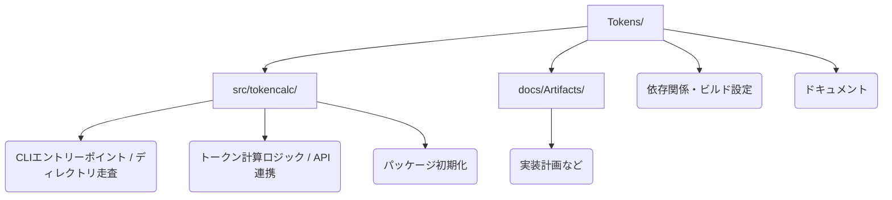

# プロジェクト分析レポート

**日付**: 2026年1月18日
**対象プロジェクト**: Tokens (TokenCalc)

## 1. プロジェクト概要
**TokenCalc** は、指定されたディレクトリ内のテキストファイルをスキャンし、Anthropic (Claude), OpenAI (GPT), Google (Gemini) の各モデルにおけるトークン数を計算・集計するCLIツールです。Poetryを用いてパッケージ管理が行われています。

## 2. ディレクトリ構造と主要ファイル

### 主要ファイルの役割
- **`src/tokencalc/main.py`**: アプリケーションのエントリーポイント。`click` ライブラリを使用してCLI引数を処理し、ファイルシステムの走査、フィルタリング、結果の出力を行います。
- **`src/tokencalc/counter.py`**: コアロジック。`TokenCounter` クラスを含み、`anthropic`, `tiktoken`, `google-genai` ライブラリを使用して各モデルのトークン数を計算します。APIキー欠落時のフォールバック処理も実装されています。
- **`pyproject.toml`**: プロジェクトの設定ファイル。依存ライブラリ（`anthropic`, `tiktoken`, `click`, `google-genai`）やスクリプトエントリーポイントが定義されています。

## 3. 難易度評価

| 評価項目 | スコア (1-5) | コメント |
| :--- | :---: | :--- |
| **技術的複雑性** | **2** | ロジック自体はシンプルですが、複数の外部API/SDKを利用しています。 |
| **依存関係の複雑さ** | **2** | 依存ライブラリは主要なSDKのみで、依存関係の競合リスクは低いです。 |
| **保守性** | **2** | コードは読みやすいですが、**テストコードが存在しない**ため、変更時の回帰バグのリスクが高いです。 |
| **スケーラビリティ** | **1** | ファイルを逐次処理（同期処理）しているため、ファイル数が増えると処理時間が線形に増加します。APIコールの待機時間がボトルネックになります。 |

**総合難易度: Level 2 (初級〜中級)**
現状は「動くプロトタイプ」レベルであり、実運用や大規模プロジェクトでの利用には改善が必要です。

## 4. 改善提案

コード品質、パフォーマンス、堅牢性を向上させるための具体的な提案です。

### 4.1. 緊急度：高（Must Have）
1. **テストコードの導入**:
    - `pytest` を導入し、単体テストを作成する。
    - 特に `counter.py` の計算ロジックや、フォールバック機能のテストが重要。
    - ファイルシステム操作をモックした `main.py` のテストも必要。

2. **エラーハンドリングの強化**:
    - 特定のファイル読み込みエラーでプロセス全体が止まらないようにはなっていますが、APIエラー時のリトライ処理（Exponential Backoffなど）が不足しています。

### 4.2. 緊急度：中（Should Have）
3. **パフォーマンス改善（非同期処理化）**:
    - 現状の同期的な `for` ループによる処理は、APIコールを含む場合非常に遅くなります。
    - `asyncio` と `aiofiles`、および各SDKの非同期メソッド（あれば）を使用して、並行処理を行うべきです。これにより、大量のファイル処理時の速度が劇的に向上します。

4. **設定の外部化**:
    - 除外ディレクトリ（`DEFAULT_EXCLUDES`）や対象拡張子（`TEXT_EXTENSIONS`）がコード内にハードコードされています。
    - `.ignore` ファイルや設定ファイル（`tokencalc.toml`など）から読み込めるようにすると利便性が向上します。

### 4.3. 緊急度：低（Nice to Have）
5. **詳細なレポート機能**:
    - 結果を標準出力だけでなく、JSONやCSV形式でファイルに出力するオプションを追加する。
    - モデルごとのコスト試算機能（トークン単価×トークン数）の追加。

## 5. 推奨アクションプラン
1. `pytest` などの開発依存関係を追加し、テスト環境を整備する。
2. `counter.py` のロジックに対するテストを作成し、現状の挙動を保証する。
3. `main.py` をリファクタリングし、非同期処理に対応させる（パフォーマンス改善）。
